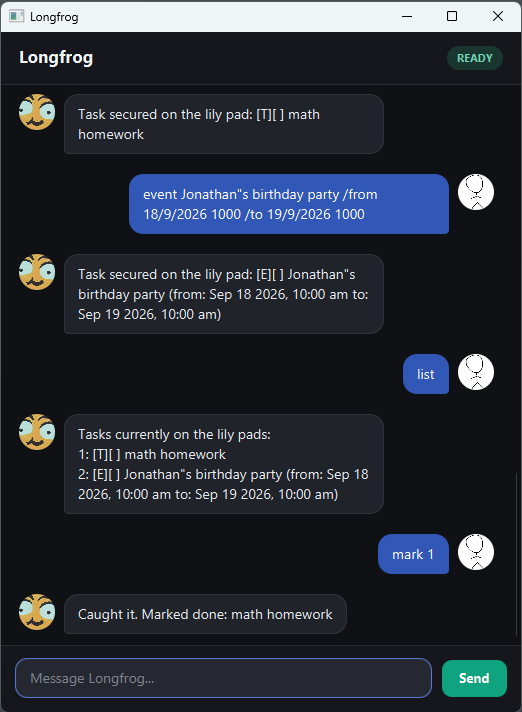

# Longfrog

Longfrog is a desktop task manager for users who prefer typing short commands. It combines a command-line style
workflow with a graphical chat interface and stores your tasks automatically between sessions.



## Quick start

1. Install Java 25 or later.
2. Download `longfrog.jar` from the [latest release](https://github.com/JamesLee5182/ip/releases/latest).
3. Move the JAR file into the folder where you want Longfrog to keep its data.
4. Open a terminal in that folder and run:

   ```shell
   java -jar longfrog.jar
   ```

5. Enter a command in the text box and press <kbd>Enter</kbd> or select **Send**.

Longfrog creates its save file at `data/longfrog.txt` relative to the folder from which you start the application.

## Features

### Command format

- Words in `UPPER_CASE` are values that you provide. For example, replace `TASK` in `todo TASK` with a description
  such as `read book`.
- `INDEX` is the task number displayed by `list`. Task numbers start at 1.
- Dates and times use `d/M/yyyy HHmm`, where the time is in 24-hour format. For example, `2/12/2019 1800` means
  2 December 2019 at 6:00 pm.
- Command keywords are case-insensitive, so `list`, `LIST`, and `List` are equivalent.
- Task descriptions cannot contain `|`, which is reserved for the save-file format.

### Adding a todo: `todo`

Adds a task without a date or time.

Format: `todo TASK`

Example: `todo read book`

### Adding a deadline: `deadline`

Adds a task that must be completed by a specific date and time.

Format: `deadline TASK /by d/M/yyyy HHmm`

Example: `deadline submit report /by 20/9/2026 2359`

### Adding an event: `event`

Adds a task with a start and end date-time. The end must be later than the start, and events may cross midnight.

Format: `event TASK /from d/M/yyyy HHmm /to d/M/yyyy HHmm`

Example: `event project meeting /from 21/9/2026 1400 /to 21/9/2026 1600`

### Listing tasks: `list`

Displays all tasks and their task numbers. `[X]` indicates a completed task, while `[ ]` indicates an incomplete task.

Format: `list`

### Marking a task as complete: `mark`

Marks the task at the specified task number as complete.

Format: `mark INDEX`

Example: `mark 2`

### Marking a task as incomplete: `unmark`

Marks the task at the specified task number as incomplete.

Format: `unmark INDEX`

Example: `unmark 2`

### Deleting a task: `delete`

Permanently removes the task at the specified task number.

Format: `delete INDEX`

Example: `delete 3`

### Finding tasks: `find`

Displays tasks whose descriptions contain the given keyword. Matching is case-insensitive and can occur anywhere in
the description.

Format: `find KEYWORD`

Example: `find book`

### Viewing tasks on a date: `date`

Displays deadlines due on the specified date and events whose date range includes that date. Todos are not included
because they do not have dates.

Format: `date d/M/yyyy`

Example: `date 21/9/2026`

### Exiting Longfrog: `bye`

Closes the application.

Format: `bye`

## Duplicate task detection

Longfrog rejects a new task if an existing task has the same type and details. Description comparisons ignore letter
case and repeated whitespace, while punctuation remains significant. Completion state is ignored.

- Todos are duplicates when their descriptions match.
- Deadlines are duplicates when their descriptions and deadline date-times match.
- Events are duplicates when their descriptions, start date-times, and end date-times match.

Tasks of different types are not duplicates. Existing duplicates in a save file are preserved, and Longfrog displays
a warning when it starts.

## Saving data

Longfrog saves the current task list automatically after every valid command. No manual save command is required.

The save file is plain text at `data/longfrog.txt`. Editing it manually is not recommended: malformed entries may be
ignored when Longfrog next starts. Back up the file before making manual changes.

## Command summary

| Action | Format | Example |
| --- | --- | --- |
| Add a todo | `todo TASK` | `todo read book` |
| Add a deadline | `deadline TASK /by d/M/yyyy HHmm` | `deadline submit report /by 20/9/2026 2359` |
| Add an event | `event TASK /from d/M/yyyy HHmm /to d/M/yyyy HHmm` | `event meeting /from 21/9/2026 1400 /to 21/9/2026 1600` |
| List tasks | `list` | `list` |
| Mark complete | `mark INDEX` | `mark 2` |
| Mark incomplete | `unmark INDEX` | `unmark 2` |
| Delete a task | `delete INDEX` | `delete 3` |
| Find tasks | `find KEYWORD` | `find book` |
| View tasks on a date | `date d/M/yyyy` | `date 21/9/2026` |
| Exit | `bye` | `bye` |

## Building from source

Clone this repository, ensure Java 25 is active, and run:

```shell
./gradlew shadowJar
```

On Windows, use `gradlew.bat shadowJar`. The executable JAR is created at `build/libs/longfrog.jar`.
